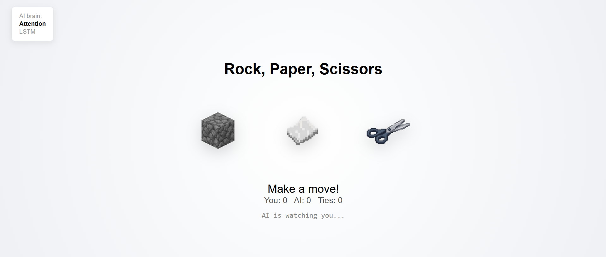

# Rock, Paper, Scissors vs a Neural Network

**▶ Play it here: [rps.talcamusic.com](https://rps.talcamusic.com)**

A browser game where the computer opponent is a small neural network that **learns your habits while you play**. Every click trains it a little more, and it uses what it has learned to predict your next move and counter it.



I built it from scratch in a single `index.html` using plain JavaScript and [TensorFlow.js](https://www.tensorflow.org/js), as a hands-on way to learn how sequence models work, first an LSTM and then an attention model (the core idea behind transformers). Once the AI worked, I wanted to know how good it really was, so I turned it into a benchmark and had AI language models play against it: hundreds of rounds, one move at a time, each move explained.

This README covers how the game works and what those matches showed.

> **Update:** the game now has a third brain, a **mini transformer**, built from the same block GPT uses. [See how it compares ↓](#update-a-mini-transformer)
>
> **Update 2:** and a fourth, a **mini GPT**: two stacked blocks, a causal mask, and GPT-style training. [Results ↓](#update-2-a-mini-gpt)

---

## How the game works

```
you click a move
      │
      ▼
AI looks at your last 6 moves ──► predicts your next move ──► plays the move that beats it
      │
      ▼
your move is added to the history ──► the network retrains on the whole history (20 epochs)
```

A few pieces worth calling out:

- **One-hot encoding.** Moves are fed to the network as `rock = [1,0,0]`, `paper = [0,1,0]`, `scissors = [0,0,1]`, so no move looks "bigger" than another.
- **Sliding window.** The network only sees your last 6 moves (`WINDOW = 6`). Your history is cut into overlapping windows, each labelled with the move you actually played next.
- **Online learning.** There's no pre-training. The model starts from nothing and learns only from you, in real time. For the first 7 rounds it doesn't have enough data, so it plays randomly.
- **Honest play.** The AI commits to its move *before* your click is recorded, so it can't peek.
- **"AI expected you to play…".** After each round the page shows what the AI predicted and how confident it was. This turns out to matter a lot (see below).

### Two brains

**LSTM (Lesson 4).** A recurrent network that reads your moves one at a time, in order, keeping a 16-number "memory". Built with `tf.sequential`.

**Attention (Lesson 5).** Instead of reading moves one by one, attention looks at all 6 moves at once and learns *which past moves matter* for the next prediction:

1. Embed each move into a small learned vector.
2. Make three versions of it: **Q** ("what am I looking for?"), **K** ("what do I contain?"), **V** ("what do I pass on?").
3. Score every move against every other move (`Q · Kᵀ`), softmax the scores into weights, and mix the `V` vectors with them.
4. Flatten, then a 3-way softmax for rock, paper and scissors.

Two things made this harder than the LSTM:

- **Attention has no sense of order.** It sees the 6 moves as an unordered set, so "rock then paper" looks the same as "paper then rock". The fix is **positional encoding**: each move also gets a one-hot of its position in the window, so `rock at position 0` becomes `[1,0,0, 1,0,0,0,0,0]`.
- **Q, K and V all branch off the same tensor,** which a simple layer stack can't express. The model uses TensorFlow.js's **functional API** (`tf.input`, `layer.apply(...)`, `tf.model`).

An "AI brain" list in the top-left corner picks which brain you play against (attention by default). Switching keeps your score and move history but builds a fresh network, because the two models read moves in different formats. The new network immediately retrains on everything you've played so far.

---

## The experiment: can an AI beat my AI?

To test the model properly I built a command-line version (`sim/play.js` for the LSTM, `sim/play_attention.js` for attention) that runs the exact same model code as the page. It saves the network's weights *and* optimizer state between runs, so training carries over just like in the browser.

Then Claude models (Anthropic's LLMs) played it under fixed rules (`sim/PROMPT.md`):

- One command per round, and write down the reasoning *before* each move.
- No scripts that choose moves, and no peeking at the saved model state.
- Every match is logged round by round to `sim/results/*.json`.

There were two conditions:

- **With hints:** the player sees the "AI expected you to play rock (rock 62% paper 20% scissors 18%)" line after each round, like a human on the website.
- **Blind:** that line is hidden. The player only sees the result, e.g. "AI wins! paper beats rock".

### Scoreboard

| Match | Opponent | Prediction line | Rounds | Player W–L–T | AI guessed the player's move |
|---|---|---|---|---|---|
| Claude Opus 5.5 | LSTM | shown | 70 | **33–16–21** | 22% |
| Claude Sonnet 5 | LSTM | shown | 70 | **32–22–16** | 29% |
| Claude Opus 5.5 | LSTM | shown | 300 | **111–88–101** | 29% |
| Claude Opus 5.5 | Attention | shown | 70 | **30–12–28** | 16% |
| Claude Sonnet 5.5 | Attention | shown | 70 | **25–18–27** | 25% |
| Claude Opus 5.5 | Attention | hidden (blind) | 70 | **27–18–25** | 22% |
| Claude Opus 5.5 | Attention | hidden (blind) | 300 | **102–103–95** | 34% |

*"AI guessed" counts only the rounds where the network was playing, not the random opening. Pure chance is 33%. The 300-round LSTM row is the first 300 rounds of a longer match, cut to match the blind 300-round test.*

In short: **with hints, the language models win comfortably. Blind, over a long match, it's a coin flip.**

---

## Part 1: Beating the LSTM (with hints)

Both Opus and Sonnet won their 70-round matches clearly, and by similar amounts: Opus +17, Sonnet +10. Both relied on the same fact about the AI:

> The AI always plays the move that beats its top prediction. So **you only lose when it predicts your exact move.** If you know what it expects, you know what it will play.

### Strategy 1: plant a habit, then exploit the lag

For the first 7 rounds the AI plays randomly, so those rounds cost nothing. Opus played rock seven times in a row to give the network a strong, false first impression. The network then learns slowly, so it kept expecting rock for a while after Opus moved on:

| Round | Played | AI expected | Result |
|---|---|---|---|
| 8 | scissors | rock (45%) | ✅ win |
| 9 | scissors | rock (42%) | ✅ win |
| 10 | paper | scissors (39%) | ✅ win |
| 11 | paper | scissors (41%) | ✅ win |
| 12 | paper | scissors (37%) | ✅ win |

Five wins in a row. Opus's note at round 11: *"It lags about 2 rounds behind my switches."*

### Strategy 2: hedge between two guesses

When the AI could plausibly expect either of two moves, Opus played the one move that **beats one and ties the other**, so it couldn't lose either way:

> Round 19: *"Torn between repeat (expects scissors, plays rock) and my new cycle (expects paper, plays scissors). Rock covers both."* ✅ win

### Strategy 3: never play the obvious counter

Sonnet 5 kept it simpler: read the prediction, work out the AI's move, and beat it. That works best when the network is stubborn. From round 13 to 17 it kept expecting rock (45–50%), so Sonnet played scissors five times running and won all five.

### Where the LSTM bit back

The network is **overconfident**. At rounds 27–29 it was 84%, 81% and 72% sure of rock, and wrong every time. But it also picks up patterns faster than you'd think. At round 30 Opus assumed that *"Rock 71% vs scissors 19%"* couldn't flip in one round, and played scissors a third time. The LSTM had spotted the scissors run and won.

### Over 300 rounds

Opus built the lead early and then watched it shrink:

| Rounds | W–L–T |
|---|---|
| 8–100 | 41–23–29 |
| 101–200 | 36–30–34 |
| 201–300 | 30–32–38 |

Over time the LSTM learned Opus's *reasoning habits*, not just its moves: the counter-cycles, and the tendency to switch after a win. Opus's own conclusion: *"Any decision rule that is a function of my own move history eventually becomes learnable."*

The network also stayed **wildly overconfident**. In the first 300 rounds it was at least 99% sure 44 times, and right in 18 of those.

---

## Part 2: The attention model (with hints)

Opus beat the attention model **30–12–28**. The network guessed Opus's move only **16%** of the time, *worse than random guessing*. In the 17 rounds where it was at least 90% confident, it was right once.

The attention model behaved differently from the LSTM. It acts like a **memoriser**: when a short sequence of moves repeats, it recalls what you did last time.

> Round 28: Opus had earlier played paper, paper, scissors, scissors, then rock. When that sequence came up again, the model remembered it: *"AI expected you to play rock (50%)"*. ❌ loss.
>
> Round 29: Opus used that against it. The same sequence meant it would expect rock again, so it would play paper, and Opus played scissors. The model was 91% sure of rock. ✅ win

It also **saturates**: its guesses jump to 95–100% within a few rounds. That makes it very exploitable while you can see the percentages:

| Round | Played | AI expected | Result |
|---|---|---|---|
| 31 | scissors | rock 85% | ✅ |
| 32 | scissors | rock 89% | ✅ |
| 33 | scissors | rock 59% | ✅ |
| 34 | scissors | **scissors 96%** | ❌ |

Three free wins, then the window filled up with scissors and it flipped all at once. Pushing a streak one round too long was Opus's most common mistake.

Sonnet 5.5 also won against the attention model (25–18–27), with a similar approach.

---

## Part 3: Taking the hints away

Is the language model actually reading the network, or just reading the percentages? To find out, I added a `blind` mode that hides the prediction line.

### 70 rounds blind: 27–18–25

Still a win, but a smaller one. Counting only rounds where the network was playing: **26–14–23 blind vs 27–10–26 with hints**. Without the confidence numbers, Opus couldn't tell when the AI was about to switch its guess. It also didn't notice that it had fallen into habits of its own, such as playing paper after rock and paper after scissors, until the network had already exploited them.

### 300 rounds blind: 102–103–95

This is where it got interesting. Over 300 blind rounds Opus lost by one. Here's how the match went, phase by phase:

| Rounds | Opus's approach | W–L–T |
|---|---|---|
| 8–30 | Reason from its own habits | 4–10–9 |
| 31–82 | Play the digits of π as random numbers | 18–22–12 |
| 92–160 | **"Triple rule"** (below) | **28–18–23** |
| 161–224 | Clever variants of the triple rule | 21–22–21 |
| 225–300 | Plain triple rule, held to the end | 24–25–27 |

**Reasoning was a pattern.** In rounds 8–30 the network guessed Opus's move 10 times out of 23. The careful "play the move that's safe against both likely guesses" logic is itself predictable, and the network trains on exactly that behaviour.

**Randomness, and a lesson about randomness.** Opus switched to the digits of π as a source the network can't learn (3, 6, 9 = rock; 1, 4, 7 = paper; 2, 5, 8 = scissors). On average, random play can't be beaten. But π happened to produce a run where rock was often followed by scissors, and the network grabbed it: **seven losses in a row** (rounds 56–62). Random sequences have local patterns, and an online learner will exploit them for a few rounds before they disappear.

**The triple rule.** Across all the matches the attention model showed a tendency: *when a 3-move sequence repeats, it guesses you'll do what you did last time.* It can only see 6 moves, so it can't learn "this player does something *different* each time". The rule: find the last time your previous three moves occurred, see what you played next, and play the move that beats the AI's counter to it.

> Round 92: the last three moves were rock, paper, rock. Last time (rounds 86–88) that was followed by rock. Expect the AI to predict rock and play paper. Play scissors. ✅ win

It worked for about 50 rounds and took Opus from 9 down to 7 up. Then the network caught on, and started predicting the *rule's output*:

> Round 161: a loss whose guess matched exactly what the triple rule would play. That was the fifth such loss in a short span.

**Trying to be clever made it worse.** Opus kept inventing counter-rules ("it now predicts my rule, so do the step after that"). Each one won a few rounds and was then learned. A recount later showed the *plain* rule would have gone 22–13–10 over rounds 180–224, while the clever variants went 14–14. It then held the plain rule to the end; the only two rounds where it deviated (279–280) went tie, loss.

---

## Part 4: LSTM vs attention, head to head

The matches above measure the *player* as much as the model. To compare the models fairly, `sim/compare.js` feeds both of them the **same scripted move sequences** and measures how often each one guesses right (150 rounds × 3 seeds).

| Scripted player | LSTM | Attention | Best possible |
|---|---|---|---|
| Cycle (rock → paper → scissors → …) | 97.0% | 98.1% | 100% |
| Switching (cycle reverses halfway) | 91.4% | 94.2% | ~100% |
| Biased (60% rock, random order) | 46.2% | 40.1% | 60% |
| Uniform random (control) | 35.9% | 33.1% | 33% |

- **Clean patterns:** both models nail them, reaching 100% in the second half of the cycle test. Attention is slightly quicker, including after the pattern reverses.
- **Noisy bias:** this is the surprise. The best strategy against a player who throws rock 60% of the time is just "always guess rock". Neither model finds it. Both chase patterns in the noise instead, and both get *worse* in the second half as they overfit a growing history. The LSTM handles this better.
- **Random:** both stay at chance, as they should.

At this size (a 16-unit LSTM, 8-dimensional attention) the two architectures are roughly equal. The differences are a few points, and only the biased-player gap is big enough to take semi-seriously.

*Correction: a later re-run showed that even the biased-player gap is within run-to-run noise. See the [update](#update-a-mini-transformer).*

---

## Unexpected findings

- **A one-argument bug froze the game.** `tf.layers.softmax()` in TensorFlow.js defaults to `axis: 1`, not the last axis, and fails on the 3-D attention scores. Nothing happened until round 7, when training first ran in the background and failed silently. On round 8 the game stopped responding. Fix: `tf.layers.softmax({ axis: -1 })`.
- **The networks are confidently wrong.** Across the matches, the rounds where the AI was ≥90% sure were mostly misses (1 of 17, 1 of 5, 4 of 20). Online training on a small, shifting history produces extreme probabilities that don't mean much.
- **Being clever is a pattern.** Every deterministic strategy the language model used was eventually learned, usually within 30–50 rounds.
- **Random isn't smooth.** Even a perfect random source loses runs of rounds to a fast online learner, because short-term patterns appear by chance.
- **Simple beats smart on noisy data.** A "just guess the most common move" baseline beats both networks against a biased player.

---

## Conclusion

- **Small sequence models are excellent at clean, repeating patterns** and poor at noisy ones. Against a human who repeats themselves, which most people do, the AI will win. Against a disciplined random player, it can't.
- **Frontier language models are strong strategic players when they can see the model's state.** With the prediction line visible, every Claude match was a win (up to +18 over 70 rounds). The models reasoned correctly about lag, overconfidence and hedging.
- **Take away the window into the model and the edge disappears over time.** Blind, over 300 rounds, Opus 5.5 finished 102–103–95. It found a rule that worked for 50 rounds, and then the tiny network learned it. A model with fewer than 500 parameters, trained live on nothing but the opponent's moves, fought a frontier LLM to a draw.
- **LSTM vs attention:** at this scale, a tie. Attention is marginally better at clean patterns, the LSTM marginally better at noisy bias. The bigger gains would come from the training setup, not the architecture: less overfitting, calibrated confidence, and a "just play the odds" fallback.

*Caveats: these are single matches, not averages, so a few rounds of luck move the results. The players knew the game's rules from the source code. The 300-round LSTM match was played with hints and the 300-round attention match without, so those two rows differ in more than the model.*

---

## Run it yourself

**Play the game:** go to [rps.talcamusic.com](https://rps.talcamusic.com), or open `index.html` locally, and use the **AI brain** list in the top-left corner to pick your opponent.

**Play from the command line** (in `sim/`, after `npm install`):

```bash
node play.js reset                        # LSTM
node play.js rock                         # play one round
node play_attention.js reset              # attention model
node play_attention.js paper blind        # play one round without the hint line
node play_attention.js status             # score and move history
```

**Compare the models:**

```bash
node compare.js                           # all four models, 150 rounds × 3 seeds, about 2 hours
node compare.js --models gpt,transformer  # only some models (comma-separated): ~65 min GPT, ~30 min transformer
node compare.js --rounds 60 --seeds 1     # quick run
```

## Repo layout

```
index.html                  the game: UI, one-hot and positional encoding, LSTM, attention, transformer and mini GPT
sim/play.js                 command-line match vs the LSTM (saves weights + optimizer state)
sim/play_attention.js       same for the attention model, with a blind mode
sim/compare.js              all four models on identical scripted players
sim/PROMPT.md               the rules the AI players followed
sim/results/                every match, round by round, with the reasoning for each move
```

---

## What's next: a mini transformer

The attention model here is a single attention layer, which is the core idea of a transformer but not a transformer itself. Next I'm going to build a **mini transformer** by adding the pieces a real transformer block has around attention:

- **Scaling the scores by √d**, which should calm the overconfidence seen throughout these matches
- **Two attention heads** instead of one, so it can track "what did they just play" and "what happened last time" at the same time
- **A feed-forward layer, residual connections and layer normalisation**, the rest of a standard transformer block

Then I'll run it through the same tests against the current attention model: the scripted-player benchmark, and fresh matches with and without hints.

Will a proper transformer block read players better, or just overfit faster on a 6-move window? That's the next experiment.

---

## Update: a mini transformer

The game now has a third option in the **AI brain** list: **Transformer**. It's one transformer block, the same structure as a single layer of GPT, just tiny (827 parameters, vs 443 for the attention model):

```
  x ──► embed ──┬──► head 1 ─┐                          (each head: Q, K, V,
                └──► head 2 ─┴► concat ► dense 8          scores / √d, softmax)
           │                                  │
           └───────────── add ◄───────────────┘   residual 1
                           │
                    layerNormalization
                           ├──► dense 16 relu ► dense 8   feed-forward
                           │                       │
                           └──────── add ◄─────────┘    residual 2
                                      │
                              layerNormalization ► flatten ► dense 3 softmax
```

What each new piece does:

- **Scaled scores.** A score is a dot product of `d` numbers, so it grows with `d`. Dividing by `√d` keeps the scores in a range where the softmax doesn't put ~100% on a single move.
- **Two heads.** Each head has its own Q, K and V, so one can learn "look at the last move" while the other learns "look at what happened last time". Two heads of size 4, joined back to 8, then mixed by a dense layer.
- **Residual connections.** The block adds its input back to its output, so it only has to learn a *correction*. If attention is useless early on, the plain embedding still gets through.
- **Layer normalisation.** Rescales each move's numbers to mean 0 and spread 1, which keeps training stable.
- **Feed-forward.** Attention *mixes* information between moves; the feed-forward layer then *thinks about each move on its own*, widening to 16 numbers and back to 8.

### The benchmark

Same scripted players, same seeded move sequences, 150 rounds × 3 seeds. I also re-ran the attention model, because the models' starting weights are random, and I wanted to know how much the numbers move between two runs of the *same* model:

| Scripted player | LSTM | Attention (run 1) | Attention (run 2) | **Transformer** | Best possible |
|---|---|---|---|---|---|
| Cycle (rock → paper → scissors → …) | 97.0% | 98.1% | 97.9% | **98.6%** | 100% |
| Switching (cycle reverses halfway) | 91.4% | 94.2% | 94.6% | **94.9%** | ~100% |
| Biased (60% rock, random order) | 46.2% | 40.1% | 45.9% | **44.5%** | 60% |
| Uniform random (control) | 35.9% | 33.1% | 35.2% | **33.1%** | 33% |

- **Clean patterns: the transformer learns fastest, by a little.** On the cycle it made exactly 2 wrong guesses per match before locking on, in all three seeds. Attention needed 3 and the LSTM 3 to 5. On the switching player it was 98% accurate in the first half, against 96% for attention and 92% for the LSTM.
- **Re-learning after the switch: no better.** In the second half, after the cycle reverses, all three models make about 5 to 7 wrong guesses while they adapt (transformer 92.0%, attention 92.4–93.3%, LSTM 90.7%).
- **Noisy bias: still not solved.** The transformer still doesn't find "just guess rock". It goes from 49% in the first half to 40% in the second, the same overfitting the LSTM showed.
- **The re-run is the real lesson.** The *same* attention model scored 40.1% on the biased player in one run and 45.9% in the next, on identical move sequences. That 6-point swing comes purely from random starting weights, and it's as big as the LSTM-vs-attention gap I called "semi-serious" in Part 4. So on noisy data, none of these models is meaningfully better than the others.

### What about the overconfidence?

I expected the `√d` scaling to fix the 99%-sure-and-wrong predictions from the matches. Building it taught me why it can't on its own: `√d` calms the **attention weights** (how much each move looks at the others), but the overconfidence was in the **final output** (rock 99%). That comes from training 20 epochs on a small, shifting history after every click, and `√d` doesn't touch it. Also, with `d = 4`, the scaling only halves the scores.

The benchmark only measures how often the top guess is right, not how confident it is, so I haven't measured this yet. The next step is fresh matches against the transformer, with and without the prediction line, to see whether its confidence numbers mean more than the attention model's.

### Verdict

At this size, a full transformer block is a **small upgrade, not a breakthrough**: it learns clean patterns a round or so faster than plain attention, it's no better on noise, and it needs almost twice the parameters. That's expected. A 6-move window with 3 possible symbols doesn't need much machinery. The residuals and layer norms matter when you *stack* blocks, which is where transformers get their power.

That's what's next: stacking two blocks, adding a **causal mask** so each move can only look at the moves before it, and training GPT-style, with a prediction at every position in the window instead of only the last.

---

## Update 2: a mini GPT

The fourth option in the **AI brain** list is **Mini GPT**. It takes the transformer block from the first update and adds the three things that turn "a transformer block" into "how GPT is built and trained":

```
  your last 6 moves (move + position one-hot)      [6, 9]
                     │
                  embed 8                           [6, 8]
                     │
        ┌────────────▼────────────┐
        │  transformer block 1    │   both blocks: 2 heads, residuals,
        ├─────────────────────────┤   layer norms, feed-forward,
        │  transformer block 2    │   and a CAUSAL MASK in every head
        └────────────┬────────────┘                 [6, 8]
                     │
        dense 3 softmax on EVERY row                [6, 3]   ← one guess per position
```

1. **Stacking.** The block is now a function, called twice in a loop: block 2 reads block 1's output. Each call creates new layers, so the two blocks learn different things. GPT-2 small does the same thing with 12 blocks.
2. **A causal mask.** Before the softmax, every attention score where a move would look at a *later* move is set to −1,000,000,000, so its weight comes out as exactly 0. Each move can only see itself and the moves before it. TensorFlow.js has no built-in layer for this, so it's a small custom layer (`CausalMask`).
3. **A prediction at every position.** Thanks to the mask, position *i* can honestly be asked to guess move *i + 1* without seeing it. So instead of one training example per window, each window gives six:

```
  input   rock  rock   paper     scissors  rock   paper
  target  rock  paper  scissors  rock      paper  [next move]
```

The targets are just the input shifted one move to the left. This is exactly how GPT is trained on text, with characters instead of moves. When playing, only the last row's guess is used.

It has 1,307 parameters. That's fewer than you might expect from two blocks, because the output layer now reads 8 numbers per row instead of a flattened 48.

### The benchmark

Same scripted players, same seeded sequences, 150 rounds × 3 seeds:

| Scripted player | LSTM | Attention (2 runs) | Transformer | **Mini GPT** | Best possible |
|---|---|---|---|---|---|
| Cycle | 97.0% | 98.1% / 97.9% | 98.6% | **99.3%** | 100% |
| Switching | 91.4% | 94.2% / 94.6% | 94.9% | **94.4%** | ~100% |
| Biased (60% rock) | 46.2% | 40.1% / 45.9% | 44.5% | **45.9%** | 60% |
| Uniform random | 35.9% | 33.1% / 35.2% | 33.1% | **33.3%** | 33% |

- **Clean patterns: the best yet.** On the cycle it made 2, 1 and **0** wrong guesses in the three seeds. In one match it never missed once the network was playing. The transformer made 2 per match, attention 3, the LSTM 3 to 5. Training on every position gives it six times as many examples from the same moves, so it locks on sooner.
- **Re-learning after the switch: slightly slower, if anything.** 98% before the reversal, the same as the transformer, but 91.1% after it, against 92–93% for the others. One possible reason: with targets at every position, the old pattern fills six times as many training examples, so there's more to unlearn. The gap is about one wrong guess, though, well within noise.
- **Noisy bias: the first model that didn't get worse over time.** 43.6% in the first half, 48% in the second. Every other model dropped or stayed flat as its history grew. That's what you'd hope for from six times more training targets: it chases noise less. But it's a single run, and the attention re-run showed that these numbers can swing by 6 points, so I'm treating this as a hint, not a result.
- **Random:** chance level, as it should be.

### Verdict

On rock, paper, scissors, the mini GPT is the most accurate model so far, but only by a round or two. Every architecture here sits within a few points of the others. Going from 443 parameters (attention) to 1,307 (mini GPT) bought faster learning on clean patterns and maybe a little resistance to noise, not a different kind of player. With a 6-move window and 3 possible symbols, there isn't much more structure to find.

The interesting part is that the same three ideas (stacking, the causal mask, and a prediction at every position) are what make GPT work on text, where there *is* a lot of structure. So that's the next step: the same model in Python and PyTorch, trained on Shakespeare instead of rock, paper, scissors.
